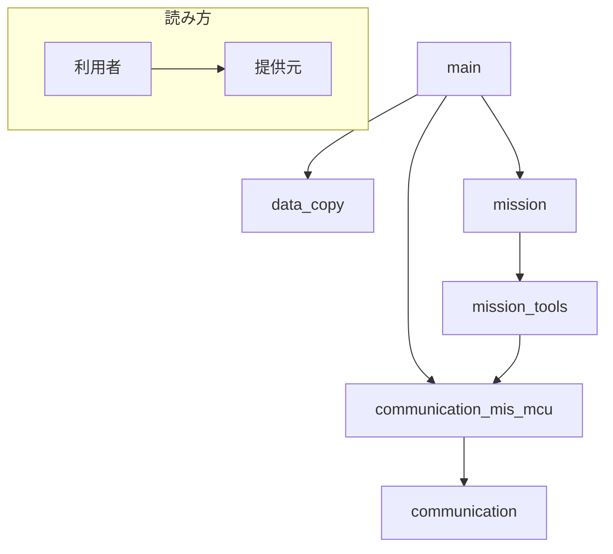

# ソフトウェア設計書
## 動作仕様
### main関数
- while TRUE
    - もしBOSS PICからの信号があれば
        - コマンドの作成
        - コマンドの実行
            - もしアップリンクコマンドであれば
                -  **Missionの実行**
            - もしステータスチェックであれば
                - 現在のステータスの返信
            - もしSMFの使用の可否であれば
                - 可能であれば
                    - **SMFへのコピー**

    - もしミッション終了後かつSMFへのコピーがなければ
        - ステータスを動作終了に変更

    - もし動作終了をBOSS PICに送信していれば
        - while TRUEを抜ける


### 割り込み関数
- INT_TIMER0
    - 時間割り込み
    - 内部クロックにより0.01秒ごとに割り込み処理が発生する
- INT_RDA
    - UART受信割り込み
    - BOSS PICからの信号受信により割り込み処理が発生する

## ライブラリ関係



## グローバル変数
- 時間関係
    - unsigned int32 dsec
    - unsigned int32 sec
    - unsigned int16 day

- 受信バッファ 
    - unsigned int8 boss_receive_buffer
    - int8 boss_receive_buffer_size

- FrameIDとcontent長の対応テーブル
```
const FrameID frame_ids[RECEIVE_FRAME_KINDS] = {
    {UPLINK_COMMAND, UPLINK_COMMAND_LENGTH}, 
    {STATUS_CHECK, STATUS_CHECK_LENGTH}, 
    {IS_SMF_AVAILABLE, IS_SMF_AVAILABLE_LENGTH}
}
```

- MIS MCUのステータス管理
    - int8 status

- 実行済みミッションの管理
    - unsigned int8 executed_mission
    - int8 executed_mission_count

- ミッション終了後の継続時間
    - unsigned int16 duration_sec

- ミッション事項中にSMFを使っているかどうか
    - int1 is_use_smf_req_in_mission

- SMFにコピーするデータのリスト
    - SmfDataStruct smf_data[SMF_DATA_SIZE]
    - int8 smf_data_head
    - int8 smf_data_tail


## 定数
- 時間関係
    - SEC_IN_A_DAY 86400

- 通信関係
    - SFD 0xAA

- デバイスID
    - MAIN_PIC  0x00
    - COM_PIC   0x01
    - RESET_PIC 0x02
    - FAB_PIC   0x03
    - BOSS_PIC  0x04
    - APRS_PIC  0x05
    - CAM_MCU   0x06
    - CHO_MCU   0x07
    - NAKA_PIC  0x08
    - SATO_PIC  0x09
    - BHU_MCU   0x0A
    - CIGS_PIC  0x0B
    - SELF_DEVICE_ID XXXX

- 受信フレームID関連
    - UPLINK_COMMAND        0x00
    - STATUS_CHECK          0x01
    - IS_SMF_AVAILABLE      0x02
    - UPLINK_COMMAND_LENGTH     9
    - STATUS_CHECK_LENGTH       0
    - IS_SMF_AVAILABLE_LENGTH   1
    - RECEIVE_FRAME_KINDS 3

- 送信フレームID
    - MIS_MCU_STATUS 0x01
    - ACK 0x0F

- 配列のサイズ
    - CONTENT_MAX 32
    - PARAMETER_LENGTH 8
    - SMF_DATA_SIZE 16
    - EXECUTED_MISSION_SIZE 64

- MIS MCU Status (enumは列挙型**定数**であるため定数として扱う)
```
typedef enum {
    EXECUTING_MISSION = 0x02,
    IDLE              = 0x03,
    SMF_USE_REQ       = 0x04,
    COPYING           = 0x05,
    FINISHED          = 0x06
} MisMcuStatusContent;
```

- Is SMF Available
```
typedef enum {
    ALLOW = 0x00,
    DENY  = 0x01
} IsSmfAvailableContent;
```

## データ構造
```
typedef struct {
    int8 id;
    int8 length;
} FrameID;
```

```
typedef struct {
    int8 frame_id;
    unsigned int8 content[CONTENT_MAX];
    int8 size;
    int1 is_exist;
} Command;
```

```
typedef struct {
    unsigned int32 src;
    unsigned int32 dest;
    unsigned int32 size;
} SmfDataStruct;
```